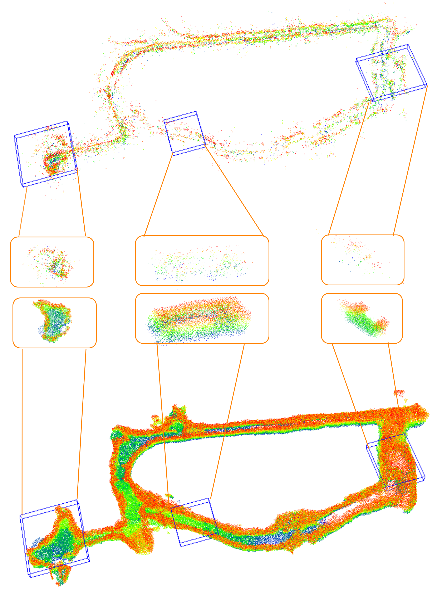
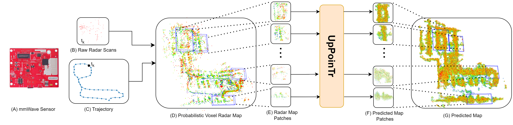
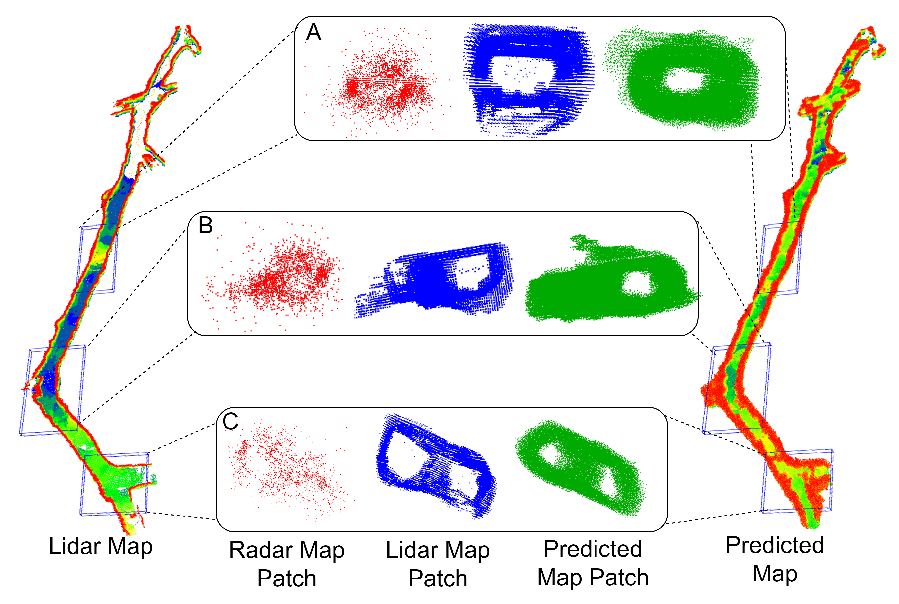

# RMap: Millimter-Wave Radar Mapping Through Volumetric Upsampling
RMap (RadarMapping), a method to generate highprecision 3D maps using radar point clouds extracted from an mmWave sensor. 


We present an end-to-end pipeline for generating the 3D maps from radar point clouds and demonstrate how these maps can be leveraged to construct a 3D map resembling lidar-based maps through UpPoinTr.


## Results:
RMap genrated maps for ColoRadar dataset:


Through this crosssection analysis, we see that the original radar map consists primarily of noise. However, the RMap generated map has a similar structure to the lidar map, distinguishing between free space and occupied space.



## Citation
If you find our work useful in your research, please consider citing: 
```
@article{mopidevi2023rmap,
  title={RMap: Millimeter-Wave Radar Mapping Through Volumetric Upsampling},
  author={Mopidevi, Ajay Narasimha and Harlow, Kyle and Heckman, Christoffer},
  journal={arXiv preprint arXiv:2310.13188},
  year={2023}
}
```
